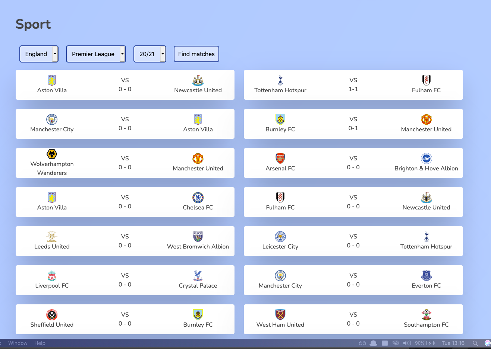

# Happy-App

Available at [Happy-App](https://hoolek77.github.io/happy-app/)

[](https://hoolek77.github.io/happy-app/)

## News View

[](https://hoolek77.github.io/happy-app/#/news/)

## Sport View

[](https://hoolek77.github.io/happy-app/#/sport/)

## Weather View

[](https://hoolek77.github.io/happy-app/#/weather/)

## Running the application

```bash
git clone https://github.com/pdybowski/happy-app.git
npm install #to install all the dependencies
npm start #to build and run the app on localhost
```

## Built with

- HTML/CSS/JS - development

## Tools used

- ES6+ JavaScript - for modern JavaScript feautures
- Babel - for compiling ES6+ JavaScript code into a backwards compatible version of it
- Webpack - for bundling all JavaScript files
- [News](https://newsapi.org/), [Sport](https://app.sportdataapi.com/), [Weather](https://openweathermap.org/) APIs - for displaying necessary information on the page
- Prettier - for same code formatting in the whole project
- Github Pages - to deploy application

## Authors

- [Piotr Dybowski - Mentor](https://github.com/pdybowski)
- [Bartosz Białecki - Prodcut Owner](https://github.com/bartoszbialecki)
- [Ireneusz Bednorz - Development Manager](https://github.com/ibednorz)
- [Szymon Kin - Tech Lead](https://github.com/hoolek77)

## Project status

In progress
